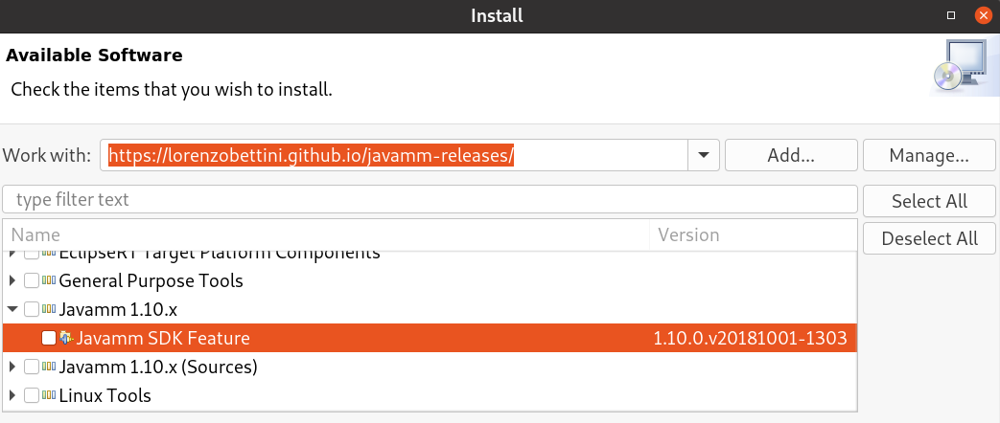

# Java--
Java-- is a simpler version of Java aiming to teach programming.

It is implemented with **Xtext**, https://www.eclipse.org/Xtext, and **Jbase**, https://github.com/LorenzoBettini/jbase.

## Installation

Starting from version 1.7.0, Java-- **requires Java 8**.

You can either install Java-- SDK into an existing Eclipse or download a pre-configured Eclipse distribution with Java-- installed (choosing the one for your operating system).

### Eclipse update site

Copy the following URL and paste it into your Eclipse "Install New Software" dialog ("Help" => "Install New Software..."), wait for the list of available features to show and select the latest version of "Java-- SDK feature". (The URL is NOT meant to be opened with a browser)

**https://dl.bintray.com/lorenzobettini/javamm/updates/**

IMPORTANT: Java-- requires Xtext, if this is not already installed, all dependencies will be automatically installed form this update site, which is self-contained.

### Pre-configured Eclipse distributions with Java-- installed, for several architectures.

Download a complete Eclipse distribution with Java-- installed; choose the one for your OS and architecture:
https://dl.bintray.com/lorenzobettini/javamm/products/

## Temporary Development Snapshots.

The snapshots are not necessarily stable, and they will be removed when the new version is released.

Update site: https://dl.bintray.com/lorenzobettini/javamm/snapshots/updates

Eclipse distributions: https://dl.bintray.com/lorenzobettini/javamm/snapshots/products/

  
